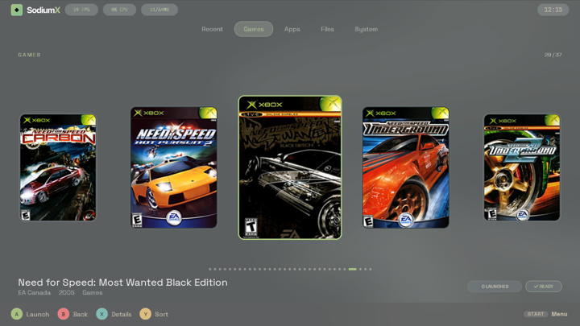
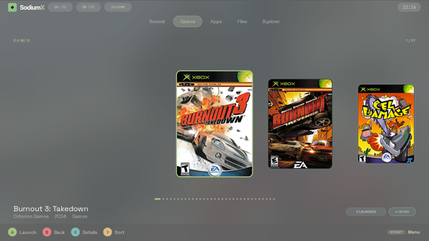
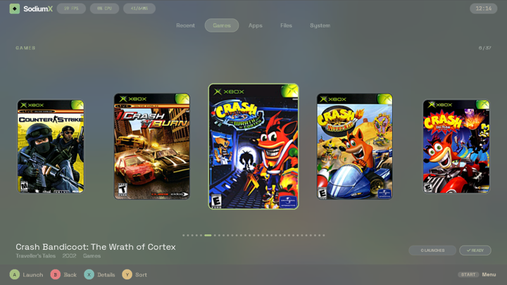
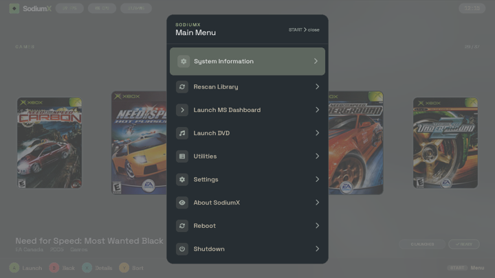
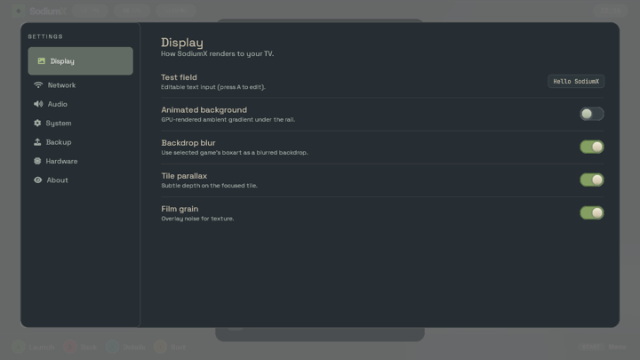
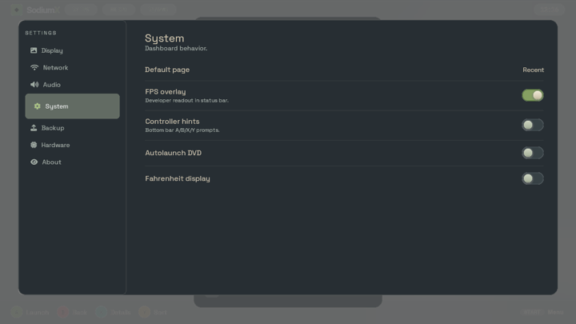
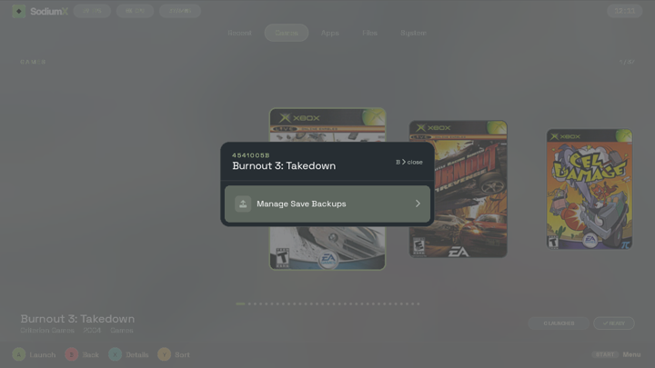
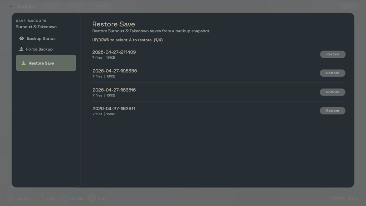

# SodiumX

A modern, GPU-accelerated replacement dashboard for the Original Xbox. Features a horizontal tile rail, Everforest dark color palette, animated backdrops, and a two-pane settings panel. Can also be compiled for Windows, Linux, and macOS for development and testing.

SodiumX is a fork of [LithiumX](https://github.com/Ryzee119/LithiumX) by [Ryzee119](https://github.com/Ryzee119).



## Features

* Horizontal tile rail with GPU-composited animations and parallax
* Blurred boxart backdrop behind the focused game
* Customisable search paths and pages via TOML config
* Game synopsis and boxart ([XBMC4Gamers artwork format](https://github.com/Rocky5/XBMC4Gamers/blob/master/README.md#game-resources-and-synopsis))
* Recently launched titles page
* Save backup and restore system (network server)
* Two-pane settings panel with live toggles
* 720p with automatic 480p fallback
* FTP server (Xbox build)
* GPU accelerated rendering (nv2a on Xbox, SDL2 on desktop)
* Remote debug server for input injection, screenshots, and log streaming

## Controls

* White/Black — Change page
* LT/RT — Fast scroll (jump 6 tiles)
* D-PAD — Navigate tiles
* Y — Show game details
* X — Game context menu (save backups)
* Start — Main menu
* A — Launch selected title
* B — Back / Close

## Screenshots









## Configuration

On first launch, `sodiumx.toml` is created at `E:\UDATA\SodiumX\` with a default template. Edit this to configure game search paths and pages.

```toml
[[pages]]
name = "Recent"

[[pages]]
name = "Games"
paths = ["E:/Games", "F:/Games"]

[[pages]]
name = "Applications"
paths = ["E:/Apps", "F:/Apps"]
```

## Build

### Original Xbox (via Docker)
```bash
./rapid.sh
```

### Original Xbox (native nxdk)
```bash
sudo apt-get update -y && sudo apt-get install -y flex bison clang lld llvm
git clone --recursive https://github.com/Promises/SodiumX.git
cd SodiumX
./src/libs/nxdk/bin/activate
make -f Makefile.nxdk -j
```

### Linux
```bash
sudo apt install pkgconf libsdl2-dev libturbojpeg0-dev libjpeg-dev
git clone --recursive https://github.com/Promises/SodiumX.git
cd SodiumX
mkdir build && cd build
cmake .. -G "Unix Makefiles"
cmake --build .
```

### macOS
```bash
brew install cmake sdl2 jpeg-turbo pkg-config
git clone --recursive https://github.com/Promises/SodiumX.git
cd SodiumX
mkdir build && cd build
cmake .. -G "Unix Makefiles"
cmake --build .
```

### Windows (MSYS2 MinGW64)
```bash
pacman -Syu
pacman -S mingw-w64-x86_64-make \
          mingw-w64-x86_64-cmake \
          mingw-w64-x86_64-gcc \
          mingw-w64-x86_64-SDL2 \
          mingw-w64-x86_64-libjpeg-turbo

git clone --recursive https://github.com/Promises/SodiumX.git
cd SodiumX
mkdir build && cd build
cmake .. -G "MinGW Makefiles"
cmake --build .
```

## Licence and Attribution

Based on [LithiumX](https://github.com/Ryzee119/LithiumX) by [Ryzee119](https://github.com/Ryzee119).

This project is shared under the [MIT License](https://github.com/Promises/SodiumX/blob/master/LICENSE). It includes code by others:

* [lvgl](https://github.com/lvgl/lvgl) — [MIT License](https://github.com/lvgl/lvgl/blob/master/LICENCE.txt)
* [nanoprintf](https://github.com/charlesnicholson/nanoprintf) — [MIT License](https://github.com/charlesnicholson/nanoprintf/blob/main/LICENSE)
* [sxml](https://github.com/capmar/sxml) — [UNLICENSE](https://github.com/capmar/sxml/blob/master/UNLICENSE)
* [tomlc99](https://github.com/cktan/tomlc99) — [MIT License](https://github.com/cktan/tomlc99/blob/master/LICENSE)
* [nxdk](https://github.com/XboxDev/nxdk) — [Various Licenses](https://github.com/XboxDev/nxdk/tree/master/LICENSES)
* [LWIP FTP Server](https://github.com/sandertrilectronics/LWIP-FreeRTOS-Netconn-FTP-Server) — [Apache 2.0](https://github.com/Promises/SodiumX/blob/master/src/lib/ftpd/LICENSE)
